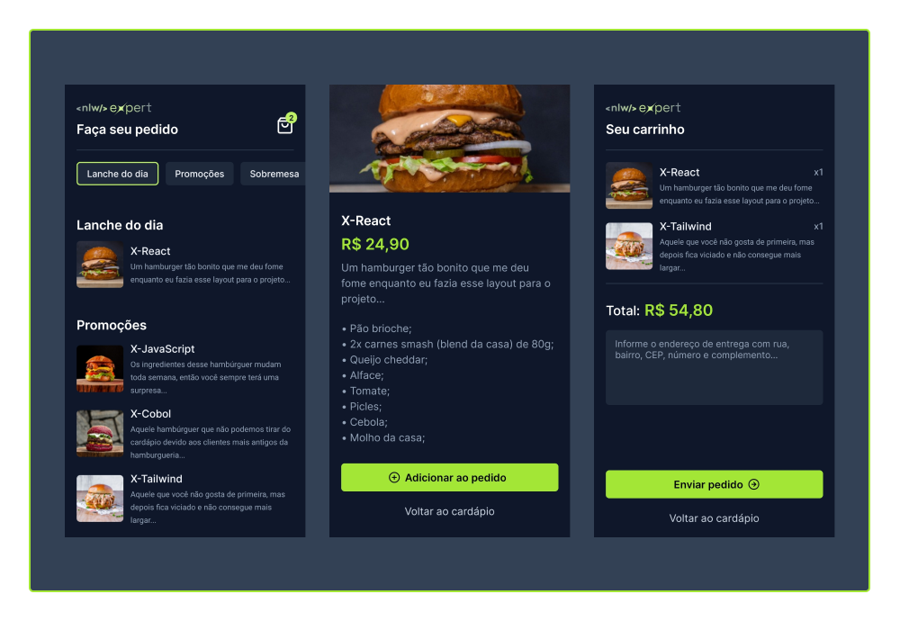

# Orders App

Aplicativo de pedidos pré-delivery desenvolvido no NLW Expert da Rocketseat.

## 💻 Projeto 

O projeto, em sua tela inicial, mostra o cardápio para o cliente. Ao clicar em um produto, ele será direcionado para uma tela com os detalhes do produto, o que inclui descrição, ingredientes, preço e a opção de colocá-lo no carrinho, o qual possui persistência de dados. Na tela do carrinho, o usuário pode remover os produtos, visualizar o valor total do seu pedido, colocar as informações para a entrega e enviar o pedido que chegará ao WhatsApp da empresa em questão.

## 📸 Preview

  

## ✨ Principais Tecnologias 

React Native, Expo, Nativewind (Tailwind), Zustand

## 📝 Licença 

Este projeto está sob a licença MIT. Veja o arquivo [LICENSE](LICENSE.txt) para mais detalhes.
